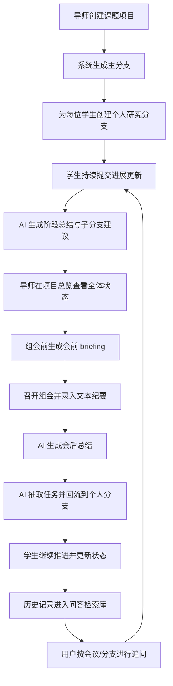

# 系统流程图

下面这张图描述的是第一版最关键的业务闭环，也就是这个系统为什么能帮助课题组协作。

## 流程解释

1. 导师先定义课题项目，系统把它视为一条主研究主线。
2. 每个学生在主线下拥有自己的研究分支，并可以继续拆小分支。
3. 学生平时提交更新，AI 负责做阶段总结和任务拆分提示。
4. 导师在组会前不必逐条翻记录，而是直接看 AI 生成的会前 briefing。
5. 组会结束后，系统把纪要整理为总结与任务，并自动回流到对应学生分支。
6. 所有历史内容都可以成为可问答的知识来源，支持会后追问与回顾。

## 这张图最想说明什么

这个系统不是单纯“记笔记”或“发任务”，而是把科研协作变成一个持续循环：

`平时更新 -> 组会整合 -> 任务回流 -> 再次推进`

这也是后续 demo 和正式系统最应该优先跑通的一条主线。
